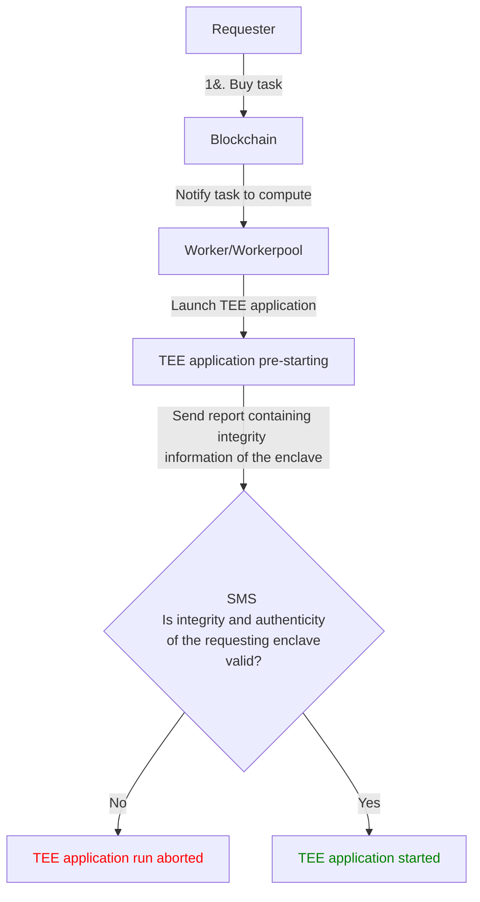

```mermaid
graph TD
    Req[Requester] --> |1&#46; Buy task| Chain
    Chain[Blockchain] --> |Notify task to compute| Worker[Worker/Workerpool]
    Worker --> |Launch TEE application| App[TEE application pre-starting]
    App --> |Send report containing integrity <br>information of the enclave| SMS{SMS <br> Is integrity and authenticity <br> of the requesting enclave valid?}
    SMS --> |No| AppFailed[TEE application run aborted]
    SMS --> |Yes| AppStarted[TEE application started]

    style AppFailed color:red
    style AppStarted color:green
```
